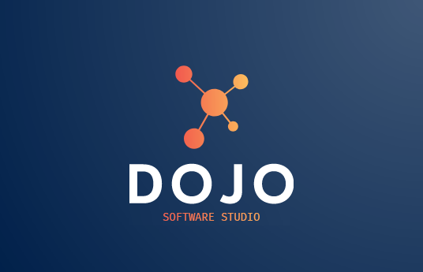

<p align="center"></p>

## WIKI

Proyecto creado con las bases para el desarrollo en DOJO

- [LARAVEL](http://laravel.com)
- [VUEjs](https://vuejs.org).

## CREAR UN PROYECTO SIMILAR

Suponiendo que ya posees una instalacion de composer, debes ejecutar en tu directorio web del servidor apache 'htdos' o 'www', el comando:

``laravel new <NombreProyecto> --auth``


Este comando instalara un nuevo proyecto laravel con todo lo necesario para el desarrollo, incluido el add de AUTH nativo de LARAVEL.

O bien podrias clonar este repositorio, pero ten cuidado al momento de commitear tu progreso, ya que por defecto el commit se realizara sobre este proyecto. +1


## RECURSOS REUTILIZABLES

En este repositorio dentra del path

`` app\Settings\``

encontraras los recursos reutilizables de la Wiki.
- **SETTINGS: Clase maestra para realizar una configuración general para las migraciones**

## Nociones generales

En este proyecto encontraras la base del modelo de vistas, usando VUE de forma nativa y/o usando solo LARAVEL

## Estructura de proyectos
- APP - Propio de Laravel, en la raiz contiene todos los modelos.
  - `Bussines` - Directorio que contiene las clases referentes al modelo de Negocio [NombreClase]Bussines.php
  - Console - Propio de Laravel
  - Exceptions - Propio de Laravel
  - `Http` - Propio de Laravel, contienen ademas el directorio de los controladores del Framework en `Controllers`
  - `Providers` - Propio de Laravel, ademas contiene los `ServiceProdivers` de cada elemento agregado al Framework
  - `Repositories` - Directorio de repositorios referentes al proyecto. En la raiz se guardan las interfaces de cada repositorio. Tambien dentro de este directorio crearemos directorios referentes a cada ORM o Motor de BBDD que se utilice, por ejemplo `Eloquent(Laravel)`, `Mongo`, `SqlServer`, etc., dentro de cada directorio se encuentran las implementaciones de los Repositoy necesarios.
  - `Settings` - Directio de clases reutilizables creadas por `DOJO`

## Uso del Patrón Repository
Como ya se mencionó anteriormente el directorio `App\Repositories` contendra las interfaces a implementar para el uso del patrón, por ejemplo
```
interface ITaskRepository{
    public function all();
    public function find($id);
    public function create($data);
    public function update($data, $id);
}
```
Dentro del directorio `Eloquent`(suponiendo que usaremos este ORM, si usamos otro motor de BBDD, sera necesario crear el directorio para este motor, e implementar dentro de este los Repositories necesarios) crearemos las clases que implementen cada interfaz, por ejemplo:
```
namespace App\Repositories\Eloquent;

use App\Repositories\ITaskRepository;
use App\Task;

class TaskRepository implements ITaskRepository{
    public function all(){
        /*
        Implmentación concreta de la funcion, ya que en este nivel se conoce el modelo en concreto que usaremos,
        podemos usar directamente el modelo de Eloquent, por ejemplo
        */
        Task::metodo...
    }
    public function find($id){
        //Implmentacion...
    }
    public function create($data){
        //Implmentacion...
    }
    public function update($data, $id){
        //Implmentacion...
    }
}
```
Implementado el repositorio, debemos agregar esto a los ServiceProviders, de la siguiente forma.
1. Creamos el service provider del Repositorio en concreto:

    ``php artisan make:provider TaskServiceProvider``

    Esto creara el archivo TaskServicePRovider en el directorio `Providers`
2. Abrimos el archivo de service provider creado y agregamos el Repository creado
```
......
    public function register(){
        /*
            $this->app->bind('interface', 'clase que implementa la interface')
        */
        $this->app->bind(
            'App\Repositories\ITaskRepository',
            'App\Repositories\Eloquent\TaskRepository'
        );
    }
.....
```
3. Finalmente en `config\app.php`
```
    /*
    Agregamos la referencia nuestro ServiceProvider: TaskServiceProvider
    */
    App\Providers\TaskServiceProvider::class,
```

### Inyeccion del Repository al controller
```
use Illuminate\Http\Request;
use App\Repositories\ITaskRepository;
use App\Task;

class TaskController extends Controller
{
    /*
    Se crea la variable de referencia al repositorio
    */
    protected $repository;

    /*
    Obligamos a cada controller a construirse con un repository(pero no con la clase en concreto,
    sino con la interfaz, para este paso es importante  haber agregado antes la interfaz
    y la clase concreta a los ServiceProviders, punto 3 lineas arriba)
    */
    public function __construct(ITaskRepository $respository){
        $this->repository = $respository;
    }
    .....
}
```

### Uso del Repository
```
....
    public function index(Request $req){
        /*
            Uso del repository
        */
        $list = $this->repository->all();
        return [ 'pagination' => [
                    'total'        => $list->total(),
                    'current_page' => $list->currentPage(),
                    'per_page'     => $list->perPage(),
                    'last_page'    => $list->lastPage(),
                    'from'         => $list->firstItem(),
                    'to'           => $list->lastItem()
                ] ,
                'tasks' => $list
                ];
    }
....
```

El Repository es importante ya que el proyecto podria cambiar a futuro de motor de BBDD y al implementar el repository, el `equipo DOJO` se adelanta a esta situación, ya que el controlador no conoce la implementacion en concreta o el motor de BBDD, solo conoce la interfaz y sus métodos.


## License

[MIT license](https://opensource.org/licenses/MIT).


## Presentacion
OJO!! todo esto dentro del directior wiki

Asumiendo que tenemos composer y node y npm instaldos

``composer install -vvv --profile`` instala las dependencias descritas en el composer.json

``npm install`` instalar todas las dependencias descritas en package.json

una vez instaldo todo ejecutar ``npm run watch``


